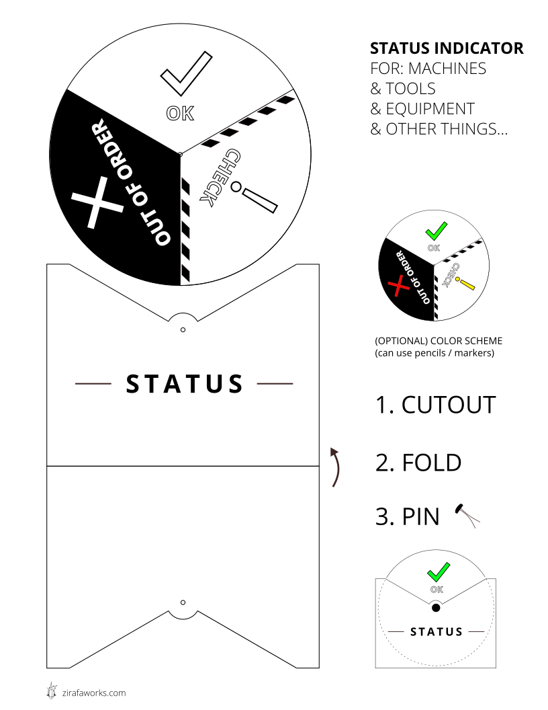

# Machine Status Indicator
### For Machines, Tools, Equipment, and Other Things

This is a printable visual status indicator intended to show the current status of shared tools and equipment in a makerspace or hackerspace. It could also be used in other spaces where showing the status of something might be useful: a commercial kitchen, a warehouse, a laboratory, or a school.

It is designed to print in black/white on 8.5x11, but benefits from the addition of color which you can fill in with a color marker or color pencil. Bendable brad fasteners work best to pin everything together. You can make it more durable by laminating it or by adding a little tape around the edges, and use some tape or velcro to attach it to the machine. 

### Instructions
1. For best results, [download machine-status-indicator.svg](https://raw.githubusercontent.com/zirafa/machine-status-indicator/master/machine-status-indicator.svg) and open in Inkscape (or Illustrator)
2. Print out on a 8.5x11 sheet of paper
3. Cut out the pieces, insert wheel inside of sleeve, and use a bendable brad fastener to pin everything together.
4. Place on various machines in your makerspace. Rotate the wheel to let others know the current status of the machine.

Designed by zirafa | zirafaworks.com

